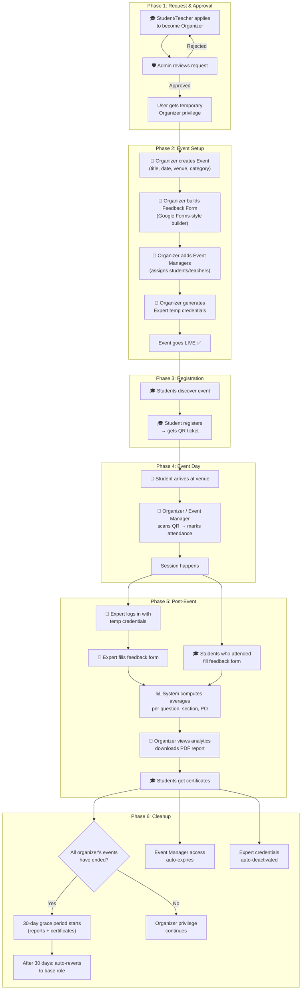

# UniEvents — System Design v2 (Revised)

> Incorporates all feedback: temporary organizer privileges, event managers, Google Forms-style feedback builder, HOD-managed PO/PSO bank, expert temp credentials, strict RBAC.

---

## 👥 Roles & Access Control

### Role Hierarchy
```
Admin (HOD/Dean)
  └── Organizer (temporary privilege, auto-reverts)
        └── Event Manager (scoped to specific event only)
              └── Student / Teacher (base roles)
                    └── Expert (temporary credentials, scoped access)
```

### Base User Types (permanent)
- **Student** — Cannot be changed by the system
- **Teacher** — Cannot be changed by the system

### Elevated Privileges (temporary, layered on top)
- **Organizer** — Granted temporarily; auto-reverts to base type **30 days after their last event ends** (grace period for report generation). Organizers can still register for their own events as attendees.
- **Event Manager** — Scoped access to ONE specific event (mark attendance + view participants); base user type is NEVER changed. **Max number of event managers per event is configurable by Admin** in system settings.
- **Expert** — Temporary login credentials created by the Organizer; each event can have **multiple experts**, each with separate credentials. Gets a dedicated expert dashboard with event overview, session materials, attendee engagement stats, and feedback submission.

---

## 🔐 Security & Access Control Model

### Principle: Zero Trust per Route

Every API route and frontend screen checks:
1. **Authentication** — Valid JWT token
2. **Role check** — User's current effective role (base + temporary privileges)
3. **Ownership check** — Can this user access THIS specific resource?

### Access Matrix

| Resource | Student | Teacher | Organizer | Event Manager | Expert | Admin |
|----------|---------|---------|-----------|---------------|--------|-------|
| Browse public events | ✅ | ✅ | ✅ | ✅ | ❌ | ✅ |
| Register for event | ✅ | ✅ | ✅ (incl. own) | ❌ | ❌ | ❌ |
| View own registrations | ✅ own | ✅ own | ✅ own | ❌ | ❌ | ❌ |
| Submit student feedback | ✅ attended | ✅ attended | ✅ (if registered & attended) | ❌ | ❌ | ❌ |
| Create event | ❌ | ❌ | ✅ | ❌ | ❌ | ✅ |
| Edit event | ❌ | ❌ | ✅ own only | ❌ | ❌ | ✅ any |
| View participants | ❌ | ❌ | ✅ own events | ✅ assigned event | ❌ | ✅ any |
| Mark attendance | ❌ | ❌ | ✅ own events | ✅ assigned event | ❌ | ✅ |
| Build feedback form | ❌ | ❌ | ✅ own events | ❌ | ❌ | ✅ |
| View feedback results | ❌ | ❌ | ✅ own events | ❌ | ❌ | ✅ any |
| View event overview | ❌ | ❌ | ❌ | ❌ | ✅ assigned | ❌ |
| View attendee stats | ❌ | ❌ | ❌ | ❌ | ✅ assigned | ❌ |
| Upload session resources | ❌ | ❌ | ❌ | ❌ | ✅ assigned | ❌ |
| Submit expert feedback | ❌ | ❌ | ❌ | ❌ | ✅ assigned | ❌ |
| Manage PO/PSO bank | ❌ | ❌ | ❌ | ❌ | ❌ | ✅ own dept |
| Approve organizer requests | ❌ | ❌ | ❌ | ❌ | ❌ | ✅ |
| Set max event managers | ❌ | ❌ | ❌ | ❌ | ❌ | ✅ |
| View all users | ❌ | ❌ | ❌ | ❌ | ❌ | ✅ |

### Data Isolation Rules
- Students **never** see other students' registrations, feedback, or personal info
- Organizers see participant data **only for their own events**
- Event Managers see participant list **only for the one event they're assigned to**
- Experts see **only** their assigned event's details and the expert feedback form
- Admins see everything within their department scope
- Feedback responses are **anonymous** to organizers (only aggregated averages shown, individual names hidden)

---

## 👤 Role 1: Student

### What They See
| Screen | Contents |
|--------|----------|
| **Landing** | Public — hero, upcoming events, CTA |
| **Events Discovery** | All published events, category filters, search |
| **Event Detail** | Full event info + "Register" button |
| **Dashboard** | My registered events (upcoming + past), QR tickets |
| **QR Ticket** | Unique QR code per registration, download as PDF |
| **Feedback** | Post-event feedback form (only if attendance = present) |
| **Certificates** | Download participation certificates (after event ends) |
| **Profile** | Personal info, department, student ID |

### What They CAN'T See
- ❌ Other students' registrations or info
- ❌ Participant lists
- ❌ Feedback results/analytics
- ❌ Admin or organizer dashboards
- ❌ Any management features

### Key Flow
```
Browse Events → Register → Get QR → Attend → QR Scanned → Give Feedback → Get Certificate
```

---

## 👤 Role 2: Teacher

> Identical to Student for event participation. Teachers may additionally:
- Be invited as Event Managers (mark attendance for specific events)
- Apply to become temporary Organizers

### What They See
Same screens as Student, plus:
| Screen | Contents |
|--------|----------|
| **Event Manager Panel** | (Only if assigned) — Participant list for assigned event + QR scanner for attendance |

---

## 👤 Role 3: Organizer (Temporary Privilege)

### How Organizer Status Works
1. Student/Teacher submits "Become Organizer" request with event proposal
2. Admin approves → User gains organizer privilege
3. User creates event(s), manages them through completion
4. **Auto-revert with 30-day grace**: When ALL of the organizer's events have ended and none are upcoming, a 30-day grace period starts. During this time the organizer can still access analytics, generate reports, and trigger certificates. After 30 days, privilege auto-reverts to base type (Student/Teacher).
5. User can re-apply for organizer if they want to create new events later

### What They See
| Screen | Contents | Access Rule |
|--------|----------|-------------|
| **Organizer Dashboard** | Stats for their own events only (total participants, attendance rate, active events) | Own data only |
| **My Events** | List of events they created (draft, published, completed) | Own events only |
| **Create Event** | Full event creation form + feedback form builder | — |
| **Feedback Form Builder** | Google Forms-style builder (see detailed spec below) | Own events only |
| **Event Participants** | Registered students list for their event | Own events only |
| **QR Scanner** | Scan QR codes to mark attendance | Own events only |
| **Add Event Managers** | Add students/teachers as managers for specific events | Own events only |
| **Expert Credentials** | Generate temporary login for resource person | Own events only |
| **Feedback Analytics** | Aggregated feedback scores, averages, PO attainment | Own events only |
| **Generate Report** | Auto-generate PDF matching the college template format | Own events only |

### What They CAN'T See
- ❌ Other organizers' events, participants, or analytics  
- ❌ Admin dashboard
- ❌ User management
- ❌ System-wide analytics
- ❌ Individual student feedback (only anonymized aggregates)

---

## 👤 Role 4: Event Manager (Scoped Access)

> A Student or Teacher given limited access to ONE specific event by the Organizer.

### Key Rules
- Their **base user type (Student/Teacher) never changes**
- Access is **scoped to exactly one event** at a time
- They can be managers for multiple events (each assigned separately)
- Access auto-expires when the event ends
- **Maximum number of event managers per event is set by Admin** in system settings (e.g., Admin sets limit to 5 managers per event)

### What They See
| Screen | Contents |
|--------|----------|
| **Their Normal Dashboard** | Still shows their regular student/teacher dashboard |
| **Manager Panel** (for assigned event) | Participant list + QR scan button for attendance marking |

### What They CAN'T See
- ❌ Event edit/delete capabilities
- ❌ Feedback form or feedback results
- ❌ Any data from other events
- ❌ Organizer dashboard features

---

## 👤 Role 5: Expert / Resource Person (Temporary Credentials)

### How Expert Access Works
1. Organizer creates the event
2. Organizer clicks "Generate Expert Credentials" → system creates a **temporary account** with:
   - Username: auto-generated (e.g., `expert_cybersec_2026`)
   - Password: random, shown once to organizer to share with expert
   - Expiry: 7 days after event date
3. Organizer shares credentials with the expert (via email/WhatsApp/etc.)
4. Expert logs in → sees their **Expert Dashboard** (scoped to assigned event)
5. After expiry, credentials are deactivated automatically

### What They See
| Screen | Contents |
|--------|----------|
| **Expert Dashboard** | Dedicated landing page after login with all the below sections |
| **Event Overview** | Full event details: title, date, venue, description, objectives, department, coordinator name, session schedule/agenda |
| **Attendee Stats** | Number of registered students, attendance count, department-wise breakdown (no personal student data — only aggregate numbers) |
| **Session Resources** | Upload presentation slides, handouts, reference materials for students to download after the event |
| **Session Notes** | Write and save session notes, talking points, or key takeaways that will be included in the final report |
| **Expert Feedback Form** | The 8-point feedback form (customized by organizer) |
| **Feedback Status** | See if feedback has been submitted; can edit until event report is generated |
| **Profile Card** | View/edit their display name, designation, and organization (shown in the generated report) |

### What They CAN'T See
- ❌ Individual student names, emails, or personal data
- ❌ Events listing or other events
- ❌ Student feedback responses
- ❌ Admin or organizer dashboards
- ❌ Registration or user management
- ❌ Anything outside their assigned event

---

## 👤 Role 6: Admin (HOD / Dean)

> **Department-scoped**: Admin (HOD) sees only events, users, and data from **their own department**. A super-admin/Dean can see all departments.

### What They See
| Screen | Contents |
|--------|----------|
| **Admin Dashboard** | Department stats (total events, students in their dept) |
| **Organizer Requests** | Pending applications from their department with approve/reject actions |
| **Department Events** | Events from their department only, with status filters |
| **Department Users** | User list within their department, with role management |
| **PO/PSO Bank** | **Add, edit, delete POs and PSOs for their department** — these are then available in the feedback form builder |
| **Reports** | Aggregate PO attainment across all events |
| **Settings** | Departments, categories, institution details, **max event managers per event limit** |

### PO/PSO Bank Management
The Admin (HOD) **defines** the POs and PSOs available for their department:

```
┌─────────────────────────────────────────────────┐
│  PO/PSO Bank — Computer Engineering Dept.       │
├──────┬──────────────────────────────────────────┤
│ PO1  │ Engineering Knowledge                    │
│ PO2  │ Problem Analysis                         │
│ PO5  │ Modern Tool Usage                        │
│ ...  │ [Admin can add/edit/remove]               │
├──────┼──────────────────────────────────────────┤
│ PSO1 │ Apply CS fundamentals...                 │
│ PSO2 │ Develop software solutions...            │
│ PSO3 │ [Admin-defined, department-specific]      │
└──────┴──────────────────────────────────────────┘
```

When an **Organizer builds a feedback form**, they see the POs/PSOs defined by the HOD of their department as **selectable checkboxes**.

---

## 📋 Feedback Form Builder (Google Forms-Style)

The Organizer gets a **drag-and-drop form builder** similar to Google Forms:

### Builder Interface

```
┌──────────────────────────────────────────────────────────┐
│  📝 Build Feedback Form for "Expert Talk on Cyber Security" │
├──────────────────────────────────────────────────────────┤
│                                                          │
│  ┌─ Section 1: Content ──────────────────── [≡] [🗑️] ──┐ │
│  │  Q1: The course met its stated aims         [1-5] ▾│ │
│  │  Q2: Well organized                         [1-5] ▾│ │
│  │  Q3: + Add Question                                 │ │
│  └─────────────────────────────────────────────────────┘ │
│                                                          │
│  ┌─ Section 2: Presentation ─────────────── [≡] [🗑️] ──┐ │
│  │  Q1: Instructor's Knowledge              [1-5] ▾│   │
│  │  Q2: Instructor's presentation style     [1-5] ▾│   │
│  │  Q3: + Add Question                                 │ │
│  └─────────────────────────────────────────────────────┘ │
│                                                          │
│  [+ Add New Section]                                     │
│                                                          │
│  ┌─ PO/PSO Mapping ─────────────────────────────────────┐ │
│  │  Select applicable POs:                              │ │
│  │  ☑ PO1 (Engineering Knowledge)                       │ │
│  │  ☑ PO2 (Problem Analysis)                            │ │
│  │  ☐ PO3  ☐ PO4  ☑ PO5  ☐ PO6  ☑ PO7  ...           │ │
│  │                                                      │ │
│  │  Select applicable PSOs:                             │ │
│  │  ☐ PSO1  ☐ PSO2  ☑ PSO3                             │ │
│  │                                                      │ │
│  │  Add PO-specific questions:                          │ │
│  │  PO1: [Question text]           [MCQ / Text] ▾      │ │
│  │       Option A: [....]                               │ │
│  │       Option B: [....]                               │ │
│  │  PO2: [Question text]           [MCQ / Text] ▾      │ │
│  │  + Add PO Question                                   │ │
│  └──────────────────────────────────────────────────────┘ │
│                                                          │
│  ┌─ Overall Rating ──────────────────────────────────────┐│
│  │  "How would you rate this event?"     [1-3 scale] ▾  ││
│  └──────────────────────────────────────────────────────┘│
│                                                          │
│  ┌─ Open-ended Questions ────────────────────────────────┐│
│  │  Q1: "Which elements did you find most useful?"      ││
│  │  Q2: "Comments/Suggestions"                          ││
│  │  Q3: "What is your takeaway?"                        ││
│  │  + Add Question                                      ││
│  └──────────────────────────────────────────────────────┘│
│                                                          │
│  ┌─ Expert Feedback Section ─── [Toggle: ON] ────────────┐│
│  │  Q1: Audio visual arrangement            [1-5]       ││
│  │  Q2: Cooperation from faculty            [1-5]       ││
│  │  Q3-Q8: [...default questions...]                    ││
│  │  + Add/Remove Expert Questions                       ││
│  └──────────────────────────────────────────────────────┘│
│                                                          │
│  [👁️ Preview Form]  [💾 Save Draft]  [✅ Publish Form]   │
└──────────────────────────────────────────────────────────┘
```

### Question Types Supported
| Type | Example | Use Case |
|------|---------|----------|
| **Rating Scale (1-5)** | ⭐⭐⭐⭐⭐ | Content & Presentation sections |
| **Rating Scale (1-3)** | Excellent / Good / Poor | Overall rating |
| **Multiple Choice (MCQ)** | A / B / C / D | PO-specific questions |
| **Short Text** | Single-line input | Takeaway |
| **Long Text** | Multi-line textarea | Comments/suggestions |
| **Yes/No** | Toggle | Simple assessments |

### Section Operations
- **Add Section** — Create any new section with custom title
- **Reorder Sections** — Drag to rearrange
- **Delete Section** — Remove entire section
- **Add Question** — Within any section
- **Question Settings** — Required/optional, question type, rating scale

---

## 🔄 Complete Event Lifecycle



### Step-by-Step Detail

| # | Who | Action | System Behavior |
|---|-----|--------|----------------|
| 1 | Student/Teacher | Fills "Become Organizer" form (proposed event, description, department) | Request saved as `pending` |
| 2 | Admin (HOD) | Reviews request in dashboard | Can Approve ✅ or Reject ❌ |
| 3 | System | On approve | Adds `organizer` privilege to user (base type unchanged) |
| 4 | Organizer | Creates event (title, category, date, time, venue, capacity, banner) | Event status = `draft` |
| 5 | Organizer | Opens Feedback Form Builder | Loads POs/PSOs from Admin's department bank |
| 6 | Organizer | Builds form: adds sections, questions, selects POs, sets scales | Form schema saved |
| 7 | Organizer | Adds Event Managers (searches users by name/email) | Manager gets scoped access to that event |
| 8 | Organizer | Generates expert credentials | Temp account created with expiry date |
| 9 | Organizer | Publishes event | Status → `published`, visible to all students |
| 10 | Student | Browses events, clicks "Register" | Registration created + unique QR code generated |
| 11 | Student | Views QR in dashboard, can download as PDF | — |
| 12 | Organizer/Manager | On event day, opens QR scanner | Camera opens, scans student QR |
| 13 | System | QR scanned | Attendance = `present`, timestamp recorded |
| 14 | Expert | Logs in with temp credentials | Sees only their event overview + expert feedback form |
| 15 | Expert | Fills 8-point expert feedback | Responses saved |
| 16 | Student | After event, feedback form appears in dashboard | Only if attendance = `present` |
| 17 | Student | Fills section-wise feedback | Responses saved (anonymous to organizer) |
| 18 | System | Computes averages per question, per section, per PO/PSO | Analytics ready |
| 19 | Organizer | Views analytics, downloads auto-generated PDF report | Report matches college template |
| 20 | Organizer | Clicks "Generate Certificates" button | Certificates created for all attended students, downloadable from student dashboard |
| 21 | System | Daily check: if organizer has no upcoming/active events | 30-day grace period starts; auto-reverts after grace |
| 22 | System | Event end date + 7 days | Expert credentials deactivated, manager access removed |

---

## 📱 Screen Inventory (Per Role)

### Screens Accessible by Each Role

| Screen | Student | Teacher | Organizer | Event Mgr | Expert | Admin |
|--------|:-------:|:-------:|:---------:|:---------:|:------:|:-----:|
| Landing Page | ✅ | ✅ | ✅ | ✅ | ❌ | ✅ |
| Events Discovery | ✅ | ✅ | ✅ | ✅ | ❌ | ✅ |
| Event Detail | ✅ | ✅ | ✅ | ✅ | ❌ | ✅ |
| Login / Register | ✅ | ✅ | ✅ | ✅ | ✅ | ✅ |
| Student Dashboard | ✅ | ✅ | ✅ | ❌ | ❌ | ❌ |
| QR Ticket View | ✅ | ✅ | ✅ | ❌ | ❌ | ❌ |
| Feedback Submission | ✅* | ✅* | ✅* | ❌ | ❌ | ❌ |
| Certificates | ✅ | ✅ | ✅ | ❌ | ❌ | ❌ |
| Organizer Dashboard | ❌ | ❌ | ✅ | ❌ | ❌ | ❌ |
| Create/Edit Event | ❌ | ❌ | ✅ | ❌ | ❌ | ✅ |
| Feedback Form Builder | ❌ | ❌ | ✅ | ❌ | ❌ | ✅ |
| QR Scanner | ❌ | ❌ | ✅ | ✅ | ❌ | ❌ |
| Participants List | ❌ | ❌ | ✅ | ✅ | ❌ | ✅ |
| Add Event Managers | ❌ | ❌ | ✅ | ❌ | ❌ | ❌ |
| Expert Credentials | ❌ | ❌ | ✅ | ❌ | ❌ | ❌ |
| Feedback Analytics | ❌ | ❌ | ✅ | ❌ | ❌ | ✅ |
| Generate Report (PDF) | ❌ | ❌ | ✅ | ❌ | ❌ | ✅ |
| **Expert Dashboard** | ❌ | ❌ | ❌ | ❌ | ✅ | ❌ |
| Expert Event Overview | ❌ | ❌ | ❌ | ❌ | ✅ | ❌ |
| Expert Attendee Stats | ❌ | ❌ | ❌ | ❌ | ✅ | ❌ |
| Expert Resource Upload | ❌ | ❌ | ❌ | ❌ | ✅ | ❌ |
| Expert Session Notes | ❌ | ❌ | ❌ | ❌ | ✅ | ❌ |
| Expert Feedback Form | ❌ | ❌ | ❌ | ❌ | ✅ | ❌ |
| Expert Profile Card | ❌ | ❌ | ❌ | ❌ | ✅ | ❌ |
| Manager Attendance Panel | ❌ | ❌ | ❌ | ✅ | ❌ | ❌ |
| Admin Dashboard | ❌ | ❌ | ❌ | ❌ | ❌ | ✅ |
| Organizer Requests | ❌ | ❌ | ❌ | ❌ | ❌ | ✅ |
| PO/PSO Bank | ❌ | ❌ | ❌ | ❌ | ❌ | ✅ |
| User Management | ❌ | ❌ | ❌ | ❌ | ❌ | ✅ |
| PO Attainment Reports | ❌ | ❌ | ❌ | ❌ | ❌ | ✅ |
| System Settings | ❌ | ❌ | ❌ | ❌ | ❌ | ✅ |

> `*` = Only after attendance is marked as present. Organizers can register for their own events and submit feedback as attendees.

---

## 🗂️ Data Models

### User
```
{
  _id, name, email, password, 
  baseRole: "student" | "teacher",   // NEVER changes
  privileges: {
    isOrganizer: Boolean,            // Temporary, auto-reverts
    organizerGrantedAt: Date,
    managedEvents: [eventId]         // Event Manager scoped access
  },
  department, studentId
}
```

### ExpertAccount (Temporary)
```
{
  _id, username, passwordHash, 
  eventId,                           // Scoped to ONE event
  createdBy: organizerId,
  expiresAt: Date,                   // Auto-deactivate after this
  isActive: Boolean,
  expertName, designation, organization,
  sessionNotes: String,              // Expert's session notes/takeaways
  uploadedResources: [               // Slides, handouts, etc.
    { fileName, fileUrl, uploadedAt }
  ]
}
```

### Event
```
{
  _id, title, description, category, 
  date, time, location, maxParticipants,
  organizerId, status: "draft" | "published" | "completed",
  posterImage, feedbackFormId,
  eventManagers: [userId],           // Scoped access users (capped by admin setting)
  expertAccountIds: [expertId],      // Can have multiple experts
  targetClass, subjectName, sessionCoordinator,
  department, agenda: String          // Session schedule/agenda visible to expert
}
```

### FeedbackForm
```
{
  _id, eventId,
  sections: [
    {
      title: "Content",
      order: 1,
      questions: [
        { text: "...", type: "rating_1_5" | "rating_1_3" | "mcq" | "text" | "yes_no",
          required: true,
          options: ["A", "B", "C", "D"]   // for MCQ
        }
      ]
    }
  ],
  poMapping: ["PO1", "PO2", "PO5"],
  psoMapping: ["PSO3"],
  poQuestions: [
    { poCode: "PO1", text: "...", type: "mcq", options: [...], answer: "..." }
  ],
  expertSection: {
    enabled: true,
    questions: [
      { text: "Audio visual system arrangement", type: "rating_1_5" },
      ...
    ]
  }
}
```

### POBank (Admin-managed, per department)
```
{
  _id, department: "Computer Engineering",
  pos: [
    { code: "PO1", description: "Engineering Knowledge" },
    { code: "PO2", description: "Problem Analysis" },
    ...
  ],
  psos: [
    { code: "PSO1", description: "Apply CS fundamentals..." },
    ...
  ],
  createdBy: adminId
}
```

### Registration
```
{
  _id, userId, eventId, 
  qrCode: "unique-string",
  attendanceStatus: "registered" | "present" | "absent",
  attendanceMarkedBy: userId,         // Could be organizer or event manager
  attendanceTimestamp: Date,
  feedbackSubmitted: Boolean
}
```

### StudentFeedback
```
{
  _id, registrationId, eventId, 
  userId,                             // For internal reference only
  responses: [
    { sectionTitle: "Content", questionIndex: 0, value: 4 },
    { sectionTitle: "Content", questionIndex: 1, value: 5 },
    ...
  ],
  poResponses: [
    { poCode: "PO1", questionIndex: 0, selectedOption: "A" },
    ...
  ],
  overallRating: 3,
  openEndedResponses: [
    { question: "Most useful element?", answer: "..." },
    ...
  ]
}
```

### ExpertFeedback
```
{
  _id, eventId, expertAccountId,
  responses: [
    { questionIndex: 0, value: 5 },  // Audio visual arrangement
    ...
  ],
  comments: "..."
}
```

---

## 🔒 Backend Security Middleware Stack

```
Request → [Auth JWT] → [Role Check] → [Ownership Check] → [Rate Limit] → Handler

Middleware Examples:
- requireAuth()           → Validates JWT, attaches user to req
- requireRole("admin")    → Checks base role OR temporary privilege
- requireEventAccess(id)  → Checks if user is organizer, manager, or admin for this event
- requireExpert()         → Validates expert temp account + checks event scope
- anonymizeFeedback()     → Strips userId from feedback responses before sending to organizer
```

### API Route Protection

| Route | Middleware |
|-------|-----------|
| `GET /events` | Public |
| `POST /events` | requireAuth, requireRole("organizer", "admin") |
| `POST /events/:id/register` | requireAuth (any logged-in user, incl. organizer for own event) |
| `GET /events/:id/participants` | requireAuth, requireEventAccess |
| `POST /events/:id/attendance` | requireAuth, requireEventAccess |
| `POST /events/:id/managers` | requireAuth, requireOrganizerOwnership, checkManagerLimit |
| `GET /events/:id/feedback-results` | requireAuth, requireEventAccess, anonymizeFeedback |
| `POST /feedback/student` | requireAuth, requireAttendance |
| `POST /feedback/expert` | requireExpert |
| `GET /expert/dashboard` | requireExpert (scoped to assigned event) |
| `POST /expert/resources` | requireExpert (upload slides/materials) |
| `PUT /expert/notes` | requireExpert (save session notes) |
| `GET /expert/attendee-stats` | requireExpert (aggregate only, no PII) |
| `GET /admin/po-bank` | requireAuth, requireRole("admin") |
| `POST /admin/po-bank` | requireAuth, requireRole("admin") |
| `PUT /admin/settings` | requireAuth, requireRole("admin") |

---

## ✅ Features Summary

### Phase 1 — Core (Done ✅)
- [x] JWT Authentication (login/register)
- [x] Role-based routing
- [x] Event CRUD
- [x] Event Discovery + filters
- [x] Student registration + QR code
- [x] Organizer request → admin approval
- [x] Basic dashboards

### Phase 2 — Feedback System (Next 🔧)
- [ ] POBank CRUD API + Admin UI
- [ ] FeedbackForm schema + API
- [ ] Google Forms-style Feedback Form Builder (Organizer)
- [ ] Student Feedback submission (post-attendance gate)
- [ ] Expert temporary credentials system
- [ ] Expert Feedback submission
- [ ] Analytics computation (avg per question, per PO)
- [ ] PDF report generation (matching teacher's template)

### Phase 3 — Access Control Enhancements 🔐
- [ ] Event Manager role (scoped attendance access)
- [ ] Organizer auto-revert system (cron/daily check)
- [ ] Expert account expiry system
- [ ] Ownership middleware on all routes
- [ ] Feedback anonymization

### Phase 4 — Polish 🌟
- [ ] Certificate generation (auto PDF)
- [ ] Email notifications
- [ ] Calendar integration
- [ ] Admin PO attainment dashboard (aggregate)
- [ ] Export all data as CSV
- [ ] QR scanner using device camera

---

## ✅ Finalized Decisions

| Decision | Answer |
|----------|--------|
| **Organizer revert timing** | 30-day grace period after last event ends (for report generation & certificates) |
| **Department scoping** | Admin (HOD) sees **only their own department's** events, users, and data |
| **Multiple experts per event** | Yes — each expert gets **separate temporary credentials** |
| **Certificate generation** | **Manual** — Organizer clicks "Generate Certificates" to trigger for all attendees |
| **Session coordinator** | Separate input field (defaults to organizer name, editable) |
| **Max event managers** | Configurable by Admin in system settings |
| **Organizer self-registration** | Organizers CAN register for their own events as attendees |

---

> **This document is now finalized and ready for implementation.** Phase 2 (Feedback System) is the next build priority.
